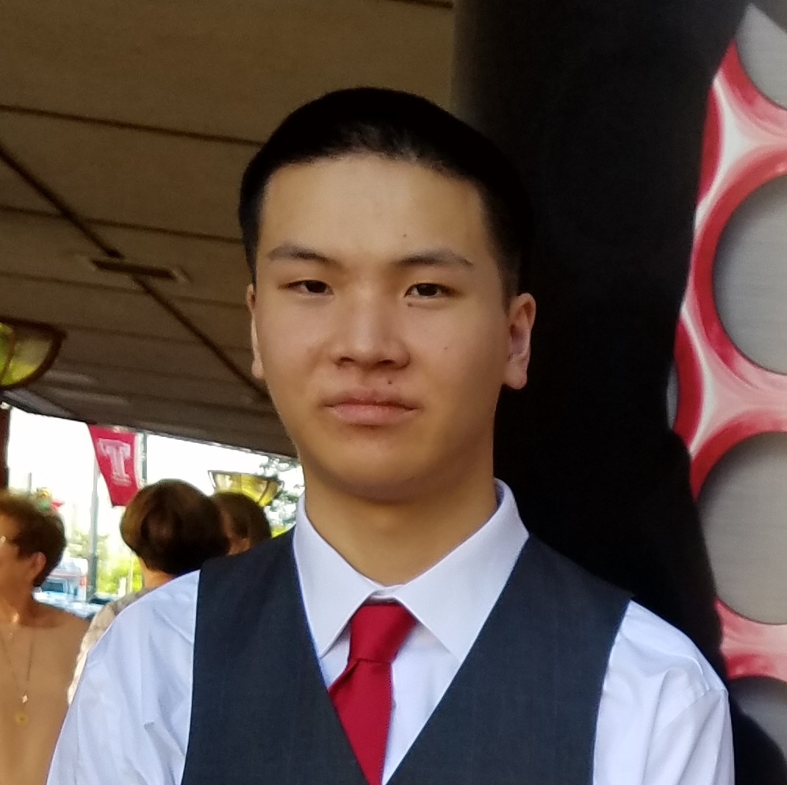

## Mid Term Mini project  - (Adv) Web Programming Course

## About Me

    Hey I'm Vincent Liang, a senior at Rowan University with hopes to start a career in Cyber Security. 
    <!--
     <a href = "/assets/images/hand1.jpg"> or possibly hand modeling</a> .
    -->

      

    Outside of school I watch baseball, exercise, listen to a lot of music and learning something new.

      

## Links and Socials

 
    <a href = "https://www.github.com/dingas0987"> GitHub</a>
     
    <a href = "https://www.linkedin.com/in/vincent-liang-5bba62190/"> LinkedIn</a>
     
    <a href = "mailto:vincent.liang2400@gmail.com"> Shoot me an Email</a>
     

